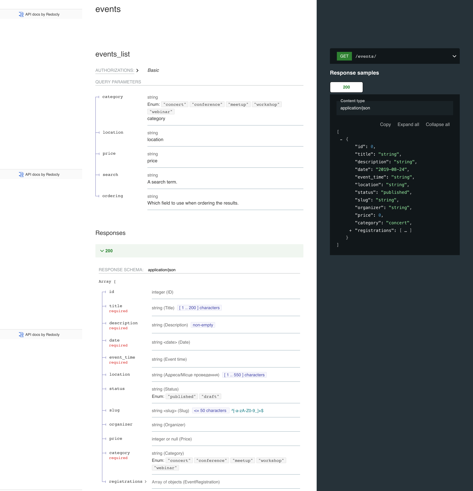
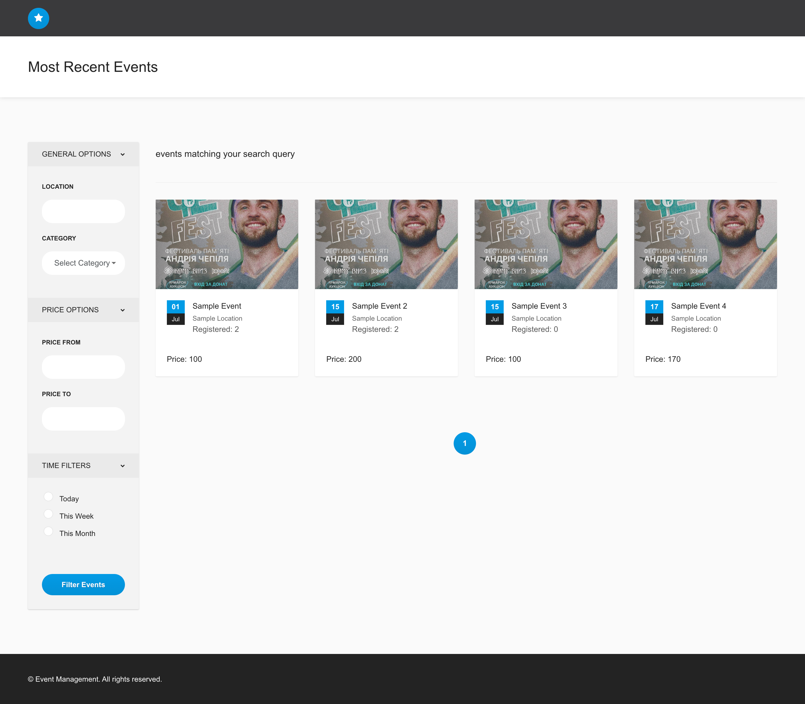

# EDjango REST-Api for Event Management

## Project Description
The primary goal of this task is to create a Django-based REST-Api that manages events (like conferences, meetups, etc.). The application will allow users to create, view, update, and delete events. It should also handle user registrations for these events.

### Features
- **Event Model**
Design an Event model with fields such as title, description, date, location, and organizer.
- **CRUD Operations**
Implement CRUD (Create, Read, Update, Delete) operations for the Event model.
- **JWT**
Basic User Registration and Authentication.
- **Rest Request for Event Registration**
Event Registration
- **API documentation**
Generate beautiful API documentation from OpenAPI with Redoc - check http://127.0.0.1:8000/redoc/
- **Search Filtering**
Implement an advanced feature like event search or filtering.

## Build and Run Commands

### Manual Setup using Virtualenv

1. **Clone the repository**:
```sh
git clone https://github.com/Madaocv/DRF_Event_Managment.git
cd DRF_Event_Managment
```

2. **Create and activate a virtual environment**:
```sh
virtualenv -p python3 venv
source venv/bin/activate
```

3. **Install the required packages**:
```sh
pip install -r requirements.txt
```

4. **Database settings**:
```sh
python manage.py migrate
```

5. **Load initial data (optional)**:
```sh
python manage.py loaddata initial_data.json
```

6. **Start the local development server**:
```sh
python manage.py runserver
```

7. **Review of the project**:
Open a browser and go to http://127.0.0.1:8000/ to see your working project.


### Setup using Docker

1. **Clone the repository**:
```sh
git clone https://github.com/Madaocv/DRF_Event_Managment.git
cd eva00
```

1. **Build the Docker containers**:
```sh
docker build -t rest_event_eliiashiv_app .
```

2. **Run the Docker containers**:
```sh
docker run -d -p 8000:8000 rest_event_eliiashiv_app
```

The application should now be running and accessible at http://localhost:8000.

## API Examples

### 1. Creating a User
```bash
curl -X POST 'http://127.0.0.1:8000/api/users/' \
--header 'Content-Type: application/json' \
--data-raw '{
    "username": "testuser",
    "email": "testuser@example.com",
    "password": "testpassword"
}'
```

### 2. Obtaining JWT Token
```bash
curl -X POST 'http://127.0.0.1:8000/api/token/' \
--header 'Content-Type: application/json' \
--data-raw '{
    "username": "testuser",
    "password": "testpassword"
}'
```

### 3. Refreshing JWT Token
```bash
curl -X POST 'http://127.0.0.1:8000/api/token/refresh/' \
--header 'Content-Type: application/json' \
--data-raw '{
    "refresh": "your_refresh_token"
}'
```

### 4. CRUD Operations for Events

#### Creating an Event
```bash
curl -X POST 'http://127.0.0.1:8000/api/events/' \
--header 'Content-Type: application/json' \
--header 'Authorization: Bearer YOUR_ACCESS_TOKEN' \
--data-raw '{
    "title": "Sample Event",
    "description": "This is a sample event.",
    "date": "2024-07-01",
    "event_time": "15:00:00",
    "location": "Sample Location",
    "status": "published",
    "price": 100,
    "category": "concert"
}'
```

#### Listing Events
```bash
curl -X GET 'http://127.0.0.1:8000/api/events/' \
--header 'Authorization: Bearer YOUR_ACCESS_TOKEN'
```

#### Retrieving Event Details
```bash
curl -X GET 'http://127.0.0.1:8000/api/events/1/' \
--header 'Authorization: Bearer YOUR_ACCESS_TOKEN'
```

#### Updating an Event
```bash
curl -X PUT 'http://127.0.0.1:8000/api/events/1/' \
--header 'Content-Type: application/json' \
--header 'Authorization: Bearer YOUR_ACCESS_TOKEN' \
--data-raw '{
    "title": "Updated Sample Event",
    "description": "This is an updated sample event.",
    "date": "2024-07-01",
    "event_time": "16:00:00",
    "location": "Updated Sample Location",
    "status": "published",
    "price": 150,
    "category": "meetup"
}'
```

#### Deleting an Event
```bash
curl -X DELETE 'http://127.0.0.1:8000/api/events/1/' \
--header 'Authorization: Bearer YOUR_ACCESS_TOKEN'
```

### 5. Registering for an Event
```bash
curl -X POST 'http://127.0.0.1:8000/api/eventregistration/' \
--header 'Content-Type: application/json' \
--header 'Authorization: Bearer YOUR_ACCESS_TOKEN' \
--data-raw '{
    "event": 1
}'
```
### 6. Unsubscribe for an Event
```bash
curl -X DELETE 'http://127.0.0.1:8000/api/eventregistration/1/' \
--header 'Authorization: Bearer YOUR_ACCESS_TOKEN' \
```
### 7. Searching and Filtering Events

#### Searching for Events by Keywords
```bash
curl -X GET 'http://127.0.0.1:8000/api/events/?search=sample' \
--header 'Authorization: Bearer YOUR_ACCESS_TOKEN'
```

#### Filtering Events by Category
```bash
curl -X GET 'http://127.0.0.1:8000/api/events/?category=concert' \
--header 'Authorization: Bearer YOUR_ACCESS_TOKEN'
```

#### Filtering Events by Location
```bash
curl -X GET 'http://127.0.0.1:8000/api/events/?location=New+York' \
--header 'Authorization: Bearer YOUR_ACCESS_TOKEN'
```

#### Filtering Events by Price
```bash
curl -X GET 'http://127.0.0.1:8000/api/events/?price_from=50&price_to=200' \
--header 'Authorization: Bearer YOUR_ACCESS_TOKEN'
```

## Screenshot Examples

### API documentation from OpenAPI with Redoc


*API documentation*

### Home Page Jinja2 Temlate


*Home Page*

These examples will help you use the API of your project to create users, obtain JWT tokens, perform CRUD operations with events, register for events, and search and filter events.